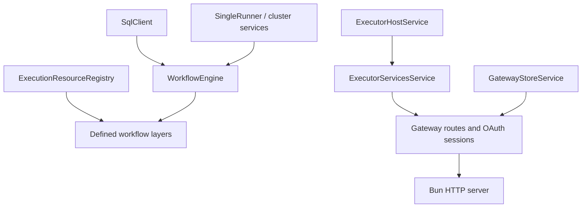

# Effect services and layers

This page inventories the repository's Effect dependency graph. It separates
actual Effect services (`Context.Service`) and Layers from ordinary service
objects whose methods return `Promise`. That distinction matters: a Layer owns
construction, dependency injection, and release; a plain object does not.

## Service graph

An arrow means "is required by". `GatewayStoreService` and
`ExecutorServicesService` are merged at the gateway composition root; neither
depends on the other.

## Application services

### `ExecutionResourceRegistry`

Source: `packages/wf/src/execution-resources.ts`

The registry is the per-execution capability lookup used by durable workflow
code. Its value is an in-memory map from execution id to:

| Resource | Purpose | Used by |
| --- | --- | --- |
| `events` | Emits workflow and step events | `emitWorkflowEvent` and the workflow implementation |
| `secrets` | Resolves secret references at execution time | step execution in `core.ts` |
| `integrations` | Invokes `{ alias, tool }` through the gateway | integration steps in `core.ts` |
| `concurrency` | Applies named step concurrency limits | step execution |
| `signals` | Buffers and delivers in-memory signals | signal waits and the test runtime |

Layers:

| Layer | Provides | Requires | Construction |
| --- | --- | --- | --- |
| `ExecutionResourceRegistry.layer(defaults)` | `ExecutionResourceRegistry` | nothing | Creates a new registry |
| `ExecutionResourceRegistry.layerOf(registry)` | `ExecutionResourceRegistry` | nothing | Publishes an existing registry used by the imperative runtime facade |

`createWorkflowRuntime` brackets each execute, signal-delivery, and resume call
with `Effect.acquireUseRelease`. Registration therefore exists for exactly the
replay that needs it and is removed on success, typed failure, defect, or
interruption. Runtime disposal clears any registrations left by active calls.

### `ExecutorHostService`

Source: `packages/wfkit-executor/src/host.ts`

This service publishes one `ExecutorHost`. The host lazily creates one Executor
SDK instance for one resolved directory. The instance combines:

- the MCP and OpenAPI Executor plugins;
- the FumaDB/Drizzle adapter over `executor.sqlite`;
- the encrypted file credential provider using `executor-auth.json` and
  `executor-auth.key`;
- the fixed local Executor tenant `wf-local`.

Layer:

| Layer | Provides | Requires | Release |
| --- | --- | --- | --- |
| `ExecutorHostService.layer(directory)` | `ExecutorHostService` | nothing | Closes the lazily-created Executor and libSQL handle |

The layer uses `Effect.acquireRelease`. Calling `host.executor()` after release
fails with `ExecutorHostClosedError`.

### `ExecutorServicesService`

Source: `packages/wfkit-executor/src/services.ts`

This service derives the complete `ExecutorServices` facade from
`ExecutorHostService`. It owns no second Executor instance.

| Layer | Provides | Requires | Intended use |
| --- | --- | --- | --- |
| `layerNoDeps` | `ExecutorServicesService` | `ExecutorHostService` | Compose with a host selected elsewhere |
| `layer(directory)` | `ExecutorServicesService` | nothing | Consumer needs only operations |
| `layerWithHost(directory)` | `ExecutorServicesService`, `ExecutorHostService` | nothing | Composition root also needs lifecycle/diagnostic access to the host |

The service value contains these focused Promise-based facades:

| Facade | Direct dependencies | Main consumers |
| --- | --- | --- |
| `catalog` | `ExecutorRunner` | discovery, provisioning, gateway catalog routes |
| `connections` | `ExecutorRunner` | provisioning, connect/disconnect routes, overviews |
| `auth` | `ExecutorRunner` | gateway OAuth sessions |
| `tools` | `ExecutorRunner` | provisioning, validation, drift, invocation, listings |
| `discovery` | `catalog` | provisioning |
| `provisioning` | `discovery`, `catalog`, `connections`, `tools` | `POST /v1/integrations/discover` |
| `validateIntegrationNode` | `tools` | `POST /v1/validate` for executor-address nodes |
| `listIntegrationOverviews` | `catalog`, `connections`, `tools` | `GET /v1/integrations` |

`ExecutorRunner.run` is the intentional bridge: the facade accepts Promise
callers, then executes the Executor SDK's `Effect` operation against the owned
instance.

### `GatewayStoreService`

Source: `apps/integrations/gateway/src/store.ts`

This service publishes the `GatewayStore` backed by `gateway.sqlite`. It owns
clients, API-key hashes, grants, approvals, audit records, retained arguments,
and drift snapshots. It does not own integration metadata or credentials.

| Layer | Provides | Requires | Failure | Release |
| --- | --- | --- | --- | --- |
| `GatewayStoreService.layer(databasePath)` | `GatewayStoreService` | nothing | `GatewayStoreInitializationError` | Closes the libSQL client |

`createGatewayService` merges this layer with
`ExecutorServicesService.layerWithHost(home)` in a `ManagedRuntime`. The
runtime is the Promise/Bun boundary: route code receives the service values,
while `GatewayService.close()` disposes all scoped resources once.

## Infrastructure layers

### `engineLayer`

Source: `packages/wf/src/engine-layer.ts`

`engineLayer(options)` builds the durable workflow engine:

1. A lazy SQLite layer creates the engine directory and provides `SqlClient`
   through `@effect/sql-sqlite-bun`.
2. A configuration layer applies `PRAGMA busy_timeout`.
3. `SingleRunner.layer` provides the single-node cluster runner and configures
   the entity-message polling interval used by durable timers.
4. `ClusterWorkflowEngine.layer` consumes the SQL and cluster capabilities and
   provides Effect's `WorkflowEngine`.

`WorkflowEngine.layerMemory` replaces this entire stack for in-memory runs.

### Defined workflow layers

Every `DefinedWorkflow` carries `workflow.layer`, generated by the authoring
runtime. `createWorkflowRuntime` composes all registered workflow layers over:

- `WorkflowEngine` from `engineLayer` or `WorkflowEngine.layerMemory`; and
- `ExecutionResourceRegistry.layerOf(...)`.

A `ManagedRuntime` is cached for each immutable sorted workflow-name snapshot.
Registering another workflow creates a new snapshot without disposing the
engine underneath active work. `WorkflowRuntime.dispose()` disposes all cached
runtimes.

`makeWorkflowEffect` is the standalone composition path. It supplies one
workflow layer, a durable `engineLayer`, and a fresh resource registry directly
to the returned Effect.

### Platform layers

Both CLI entry points supply `BunServices.layer` to Effect CLI. That layer
provides the platform capabilities used by command parsing and terminal IO.
The standalone workflow `run` function ends at `NodeRuntime.runMain`.

## Deliberately not Effect services

The following are service-shaped but remain Promise or synchronous facades:

- `WorkflowRuntime` and `WorkflowClient` are public embedding APIs around
  `ManagedRuntime` and the durable engine.
- `ExecutorCatalog`, `ExecutorConnections`, `ExecutorAuth`, and `ExecutorTools`
  are values inside `ExecutorServicesService`; they are not separate Context
  tags.
- `GatewayService` is the Bun-facing handle containing the request handler and
  a `close()` bridge to its `ManagedRuntime`.
- `GatewayClient` is a thin HTTP client and owns no long-lived resource.
- `OAuthSessions` and `MaintenanceLoop` are gateway-local lifecycle values.

Keeping these facades is intentional at package and framework boundaries. New
Effect-native domain code should depend on the Context services above rather
than constructing the underlying resources directly.
